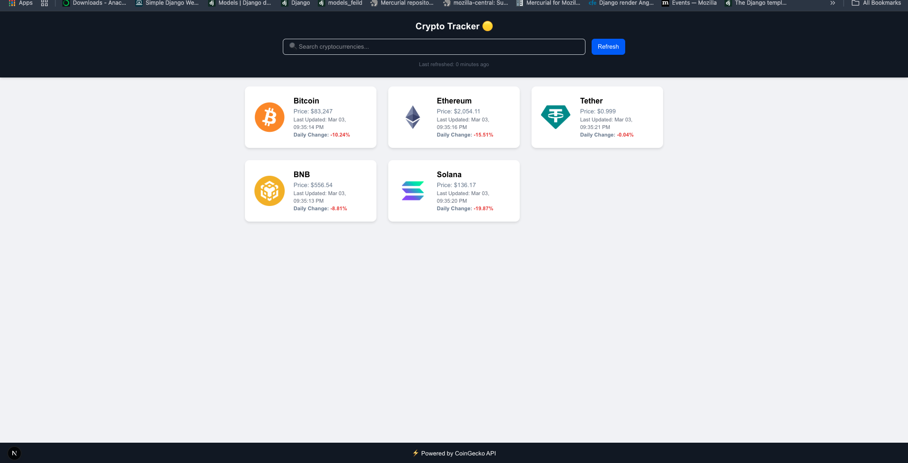

# Crypto Price

**Crypto Price** is a **Next.js** application that fetches and displays real-time cryptocurrency data using the **CoinGecko API**. It leverages **React Query** for efficient data fetching, **useState** for managing search functionality, and provides a refresh feature to keep prices updated.

## Features
- Built with **Next.js** for server-side and client-side rendering.
- Uses **React Query** to handle API calls and caching efficiently.
- Implements a **search bar** to filter cryptocurrencies dynamically.
- Includes a **refresh button** to manually update data.
- Provides error handling and loading states for a smooth user experience.

## Documentation
For more details about the application, setup guides, and API integration, refer to the documentation files located in:

📂 `docs/docs/`  
- **API Integration Details.md** – Explains how the CoinGecko API is integrated.  
- **Challenges and Solutions.md** – Discusses obstacles faced and how they were resolved.  
- **Project Setup Guide.md** – Step-by-step instructions on setting up the project.  
- **State Management Explanation.md** – Breakdown of how state and React Query are used.  

## Sample screenshot

This project provides an interactive and real-time way to track cryptocurrency prices seamlessly.
